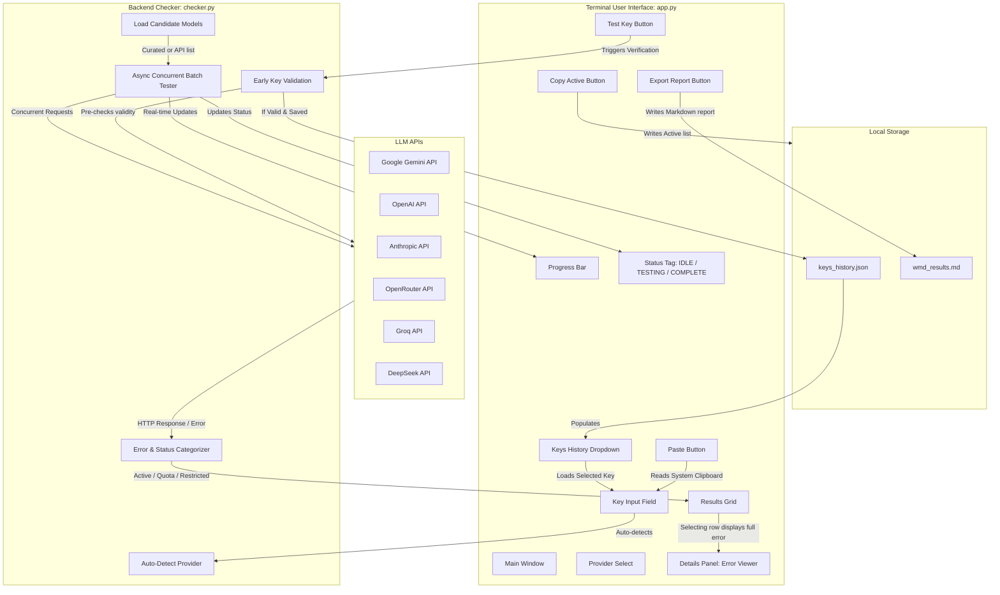

# Project Walkthrough

This document explains the file structure, how the key detection works, the overall architecture, and how to verify that everything works correctly.

---

## 📁 Project Structure

Here is the folder structure for the `wmd-my-API-ks` project:

```text
wmd-my-API-ks/
├── .gitignore            # Excludes virtual environments, caches, key history, and reports
├── README.md             # High-level overview, launcher commands, and mock key usage
├── walkthrough.md        # Detailed breakdown of files, architecture, and diagrams (this file)
├── requirements.txt      # Python dependencies (textual, httpx, rich)
├── run.bat               # Windows Command Prompt launcher
├── run.ps1               # Windows PowerShell launcher
├── checker.py            # Backend engine (regex detection, async http requests, error parsing)
├── app.py                # Textual TUI (main UI grid, clipboard paste, history select, export reports)
├── test_checker.py       # Automated unit test suite
├── keys_history.json     # (Generated locally) Stores saved key history (Git-ignored)
└── wmd_results.md        # (Generated locally) Exported Markdown report of last run (Git-ignored)
```

---

## 📊 System Architecture

The following diagram illustrates how the frontend Terminal UI (`app.py`), the backend validation logic (`checker.py`), the local key storage (`keys_history.json`), and the external provider APIs interact:



---

## 🔍 How Key Detection Works

When you type or paste a key, the program looks at the first few characters and the key's length to guess the provider:

- **Gemini**: Keys starting with `AIzaSy` (legacy) or `AQ.` (new AI Studio format).
- **OpenAI**: Legacy keys (`sk-` with 51 characters) or project keys (`sk-proj-...` with ~156 characters).
- **Anthropic**: Keys starting with `sk-ant-`.
- **Groq**: Keys starting with `gsk_`.
- **OpenRouter**: Keys starting with `sk-or-`.
- **DeepSeek**: OpenAI-compatible keys starting with `sk-` containing 35 characters in total.
- **Tavily**: Keys starting with `tvly-` (flagged as unsupported for LLM queries).

If the program cannot recognize the pattern, it allows you to select the provider manually.

---

## 🛠️ Key Improvements in Version 2

1. **ASCII Clean Layout**: Emojis and special graphics that rendered as `?` marks in standard Windows command line shells have been replaced with safe ASCII containers (e.g. `[ MAIN CONTROLS ]`).
2. **Status Indicator**: High-visibility status tag `STATUS: IDLE`, `STATUS: TESTING`, and `STATUS: COMPLETE` changes color dynamically (grey, yellow, and green) to show what the backend operations are currently doing.
3. **Selected Model Error/Details Viewer**: Long error messages are no longer truncated or allowed to overflow. When you highlight or select any row in the tested models grid, the full detailed response or error message will be rendered in a scrollable viewer panel at the bottom right.
4. **Copy & Export Functionality**:
   - **Copy Active List**: Copies only the successfully active models to the system clipboard (perfect to paste into coding assistant prompts).
   - **Export Report**: Writes a clean Markdown summary table (`wmd_results.md`) in your project folder, which is pre-configured to be ignored by Git to prevent leakages.

---

## 🧪 Verification & Test Results

We ran our tests using `test_checker.py` to confirm that the key formatting, auto-detection, and response classification work correctly.

Here are the results of the verification run:

```
Testing detect_provider...
[SUCCESS] Gemini Legacy detected
[SUCCESS] Gemini New detected
[SUCCESS] Anthropic detected
[SUCCESS] Groq detected
[SUCCESS] OpenRouter detected
[SUCCESS] Tavily key flagged as Unsupported
[SUCCESS] OpenAI Project Key detected
[SUCCESS] DeepSeek detected based on 35 character pattern
[SUCCESS] OpenAI User key detected based on 51 character pattern
All detection tests passed!

Testing mock checking backend...
[SUCCESS] Early validation succeeded for mock key
[SUCCESS] Free key allows gemini-1.5-flash
[SUCCESS] Free key restricts gemini-1.5-pro
[SUCCESS] Free key reports gemini-1.0-pro as Unsupported
[SUCCESS] Quota exhausted key flags 429 correctly
All mock checking tests passed!

CONGRATULATIONS: All core tests passed successfully!
```

---

## 🚀 How to Run the App

1. Double-click **`run.bat`** (if you are using Command Prompt / CMD) or run **`.\run.ps1`** (if you are using PowerShell).
2. The script will automatically create a virtual environment, install dependencies, and launch the application.
3. Test using mock keys to see how it works:
   - Type `mock-gemini-free` (simulates a standard Gemini Free key).
   - Type `mock-openai-quota` (simulates an OpenAI key with no remaining balance).
   - Type `mock-invalid-key` (simulates an invalid key).
   - Type `mock-gemini-all-active` (simulates a fully active paid tier key).
